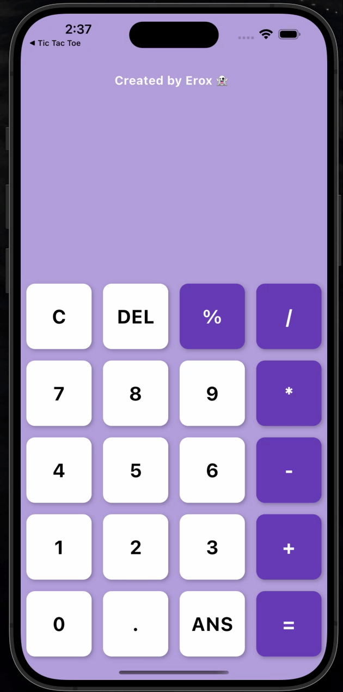

# 📱 Calculator App 🧮

A simple and stylish calculator app built with Flutter. This app provides basic arithmetic operations with a clean and user-friendly UI.
# 📌 Features

✅ Basic arithmetic operations (+, -, ×, ÷)
✅ Responsive and intuitive UI
✅ Smooth animations
✅ Lightweight and fast performance

# 🛠️ Tech Stack
	•	Flutter
	•	Dart

# 🖥️ Screenshots

#  🚀 Installation
To run this app locally, follow these steps:

### 1 - Clone the repository:
git clone https://github.com/yourusername/calculator-app.git  
cd tic-tac-toe

### 2 -  Install dependencies:
flutter pub get

### 3 - Run the app: 
flutter run

# 📜 License
This project is open-source and available under the MIT License.

📩 Feel free to contribute or report issues!

